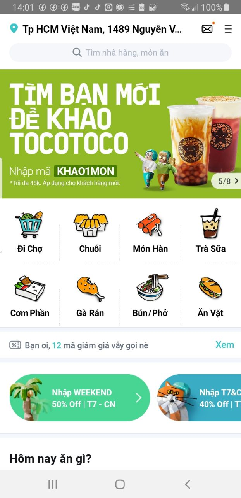
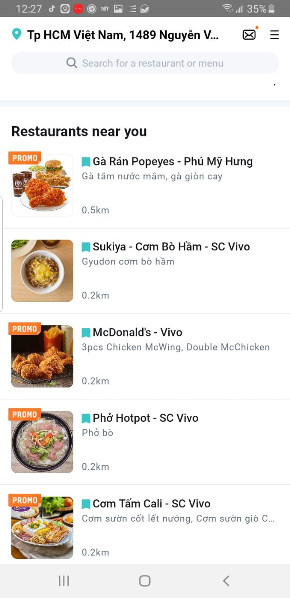
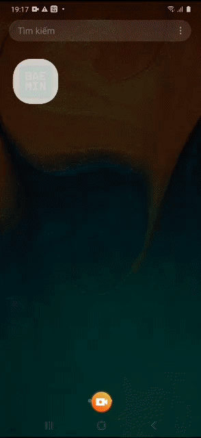

# Baemin App Clone

Flutter UI challenge

## Why ?

I have a habit of ordering food every afternoon, in the order applications I have used, I really love  UI/UX of BEAMIN app. So I chose BEAMIN as a UI Challenge.

## Target ScreenShot

   

## Demo

## Todo
- Bloc 
- Provider
- Shop Details.
